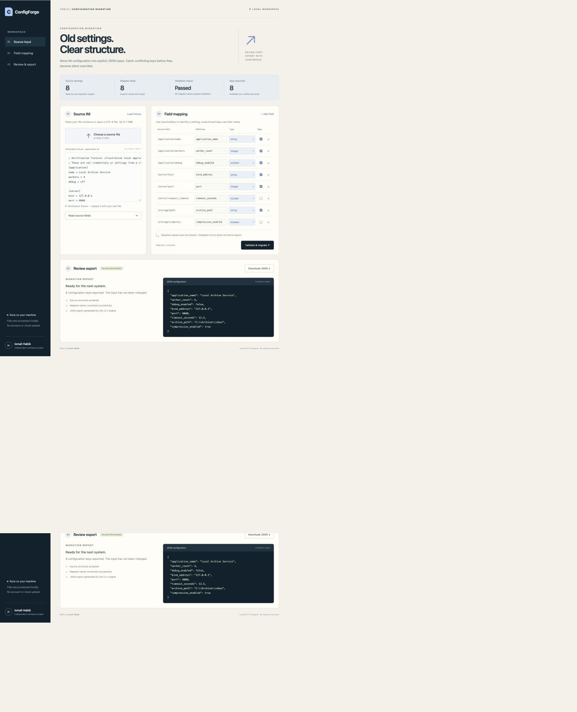
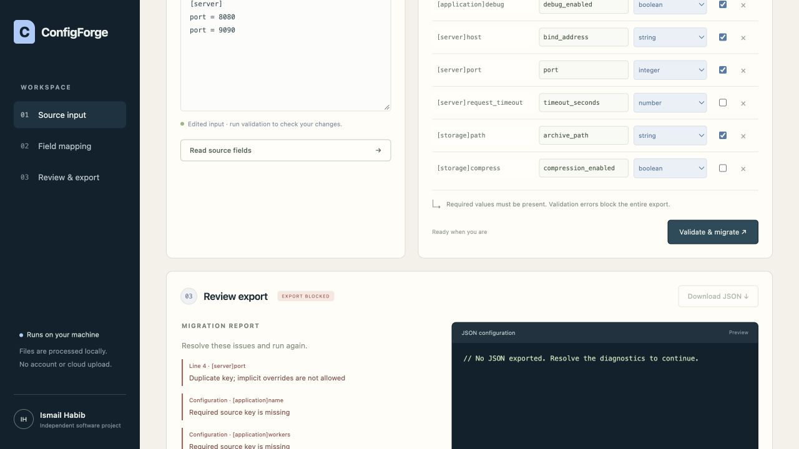

# ConfigForge — typed INI-to-JSON migration

Migrate INI settings into a flat JSON configuration with explicit names, types, and required values. A C++17 engine checks the input while a local browser workspace makes mappings, diagnostics, and generated output easy to inspect.

An independent working project by Ismail Habib. Screenshots show the running application with labeled verification inputs; they do not represent customer or production activity.

## Features

- Discover INI sections and keys, then define explicit JSON mappings.
- Convert string, integer, number, and boolean values.
- Reject duplicate settings and malformed input with source diagnostics.
- Preserve documented quoting and literal path behavior.
- Export validated settings without overwriting source files or existing destinations.

## Screenshots





See [screenshot captions](screenshots/CAPTIONS.md) for the verification context.

## Quickstart on macOS or Linux

Requirements: a C++17 compiler (`c++`, Clang, or GCC) and Python 3.10 or later. Run these commands from the cloned repository directory.

```sh
./run.sh
```

Open **http://127.0.0.1:8106**. The launcher builds the engine and starts the Python server on `127.0.0.1`. Stop with Ctrl+C. Use `./run.sh --port 8206` for another port. Set `CXX=clang++` if you want to choose the compiler.

## Use the workspace

1. Paste INI content or choose a UTF-8 file. The initial application settings are a verification fixture.
2. Select **Read source fields** after changing sections or keys. File upload performs discovery automatically.
3. Map source settings to output JSON names. Sectioned sources use **`[section]key`**; root-level sources use just **`key`**.
4. Select the type and required status for each setting. Remove fields that should be omitted, or add expected fields explicitly.
5. Select **Validate & migrate**, review the report and complete JSON preview, and download the file.

Your original file remains unchanged. Each request uses a temporary local directory that is removed afterward. The browser creates the download only after the engine returns a valid result. No remote services are called.

## Command-line migration

```sh
./build/migrator --input fixtures/application.ini --map fixtures/mapping.tsv --output /tmp/configforge-export.json
./build/migrator --input fixtures/application.ini --inspect
```

The JSON report goes to standard output. Exit status is `0` for success and `2` for a rejected migration. Existing output files cannot be replaced, and input cannot be its own output. Export writes a temporary file next to the destination and publishes it with an atomic hard link, then removes the temporary name. The target filesystem must support hard links. Atomic publication is not a guarantee of persistence after sudden power loss.

### Mapping format and types

Each mapping line contains four tab-separated values with no header:

| Source setting | JSON key | Type | Required |
|---|---|---|---|
| [server]port | port | integer | true |
| [application]debug | debug_enabled | boolean | true |
| [storage]path | archive_path | string | true |

Output is a **flat JSON object** with explicit keys. Dots in target names are literal characters and do not create nested objects. Without a mapping file, the command-line tool uses original canonical source names as JSON keys and treats values as optional strings.

Types: `string`, signed 64-bit `integer`, finite JSON `number`, and `boolean`. Boolean conversion accepts true/false, yes/no, on/off, and 1/0 without case sensitivity. Empty optional values and absent optional settings become `null`; required values cannot be absent or empty. Omitted source settings produce a warning. This utility validates types, not application-specific rules such as a valid network-port range.

### Explicit INI dialect

- UTF-8, optional BOM, LF or CRLF line endings.
- `key=value` entries, `[section]` headings, and root-level keys.
- Case-sensitive section and key names. Duplicate sections and duplicate keys are errors; no last-value-wins overrides.
- Full-line `;` or `#` comments. In unquoted values, inline comments start only when `;` or `#` is preceded by whitespace. URL fragments are therefore retained.
- Single-quoted values are literal, suitable for Windows paths. Double-quoted values recognize `\n`, `\r`, `\t`, `\\`, and `\"`. Quote delimiters must close; trailing text must be a comment.
- Keys cannot contain `[` or `]`. Section names cannot contain `[` or a closing bracket inside the name.
- No multiline continuation, interpolation, inheritance, environment expansion, includes, arrays, or repeated sections. Inputs using these dialects need explicit adaptation.
- Comments and original formatting are not retained in JSON. Source files remain unchanged for reference.

### Limits

Dashboard: 1 MiB source text, 256 mappings, 20-second engine timeout. Engine: 10 MiB input, 50,000 entries, first 100 diagnostics. This is a local single-user utility, not a hosted multi-user configuration service. It neither deploys the exported configuration nor restarts another application.

## Verify

```sh
mkdir -p build
c++ -std=c++17 -O2 -Wall -Wextra -Wpedantic src/main.cpp -o build/migrator
python3 tests/test_migration.py
```

Actual test coverage and environment are recorded in `TEST_RESULTS.md`.

## Windows build guidance — not verified on Windows

Use a Visual Studio Developer PowerShell with Python installed and run `./run.ps1`, or:

```powershell
New-Item -ItemType Directory -Force build
cl /nologo /std:c++17 /EHsc /O2 /W4 src/main.cpp /Fe:build/migrator.exe
python server.py --port 8106
python tests/test_migration.py
```

Windows compilation and runtime compatibility are unverified. A filesystem with hard-link support, such as NTFS, is required for command-line export. Build the engine from source on the target platform; generated executables are not included in this repository.

## Files

- `src/`: C++17 INI parser, schema validation, and atomic export.
- `server.py`: local HTTP adapter using only the Python standard library.
- `web/`: complete browser interface with local assets.
- `fixtures/`: labeled reproducible verification inputs.
- `tests/`: real engine and adapter behavior checks.
- `screenshots/`: captures of the running application with labeled verification inputs.

## License

[MIT](LICENSE) — Copyright (c) 2026 Ismail Habib.
